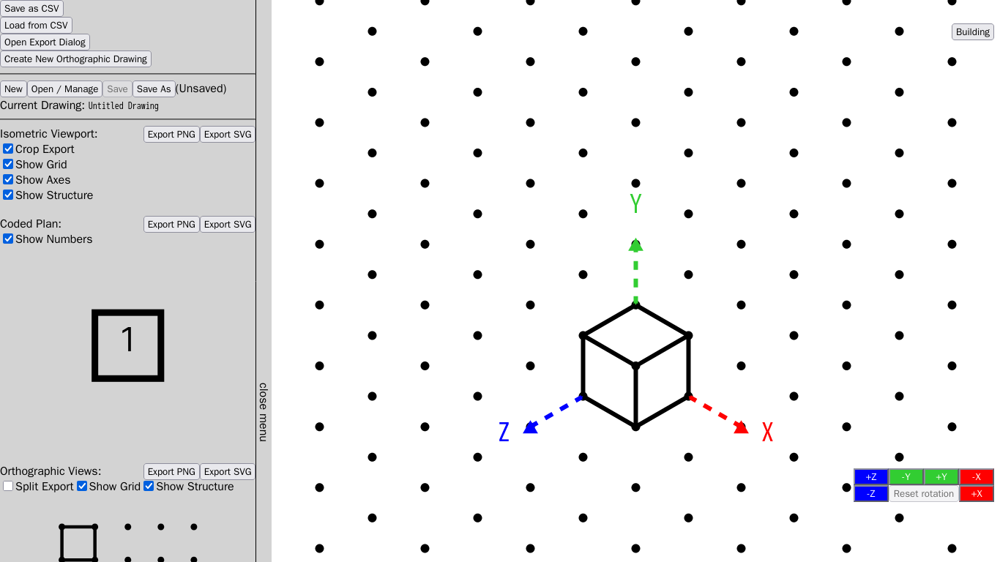
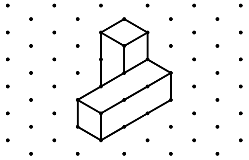

# Isometric Drawing
  
Isometric Drawing is a tool for creating isometric drawings by defining the isometric structure.
It uses a 2.5-dimensional perspective and attempts to mimic the drawing style on physical grid paper.
The tool is available at [https://wylieyyyy.gitlab.io/isometric-drawing](https://wylieyyyy.gitlab.io/isometric-drawing).

It is implemented with Isometric Drawing Toolkit, please see the associated
[README](./src/README.md) document for more detail.

#### Screenshots

### Features:
- Rotate structure by 90 degree angles;
- Generate auxiliary diagrams that link to the isometric structure;
- Export as image for printing or embedding;
- Works well on desktop or on mobile;

### Setup
1. Install Node.js from [Node.js official site](https://nodejs.org).
2. Clone this repository locally.
3. Change to the Isometric Drawing directory by using `cd`.
4. Run `npm install` to install all required dependencies.
5. Run `npm run dev` and navigate to the URL displayed on screen.

To build a static site, replace the last step with `npm run build`
and the static site content will be built in the `dist` directory.
